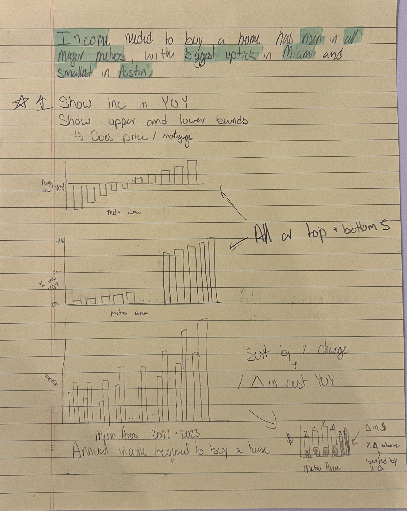
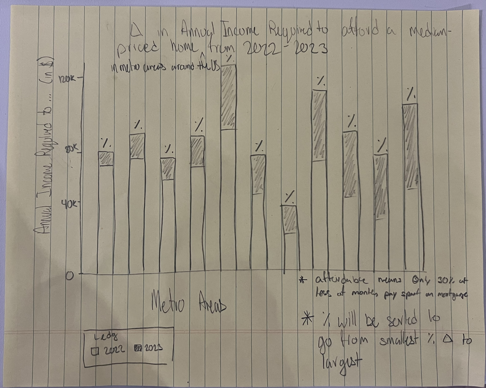
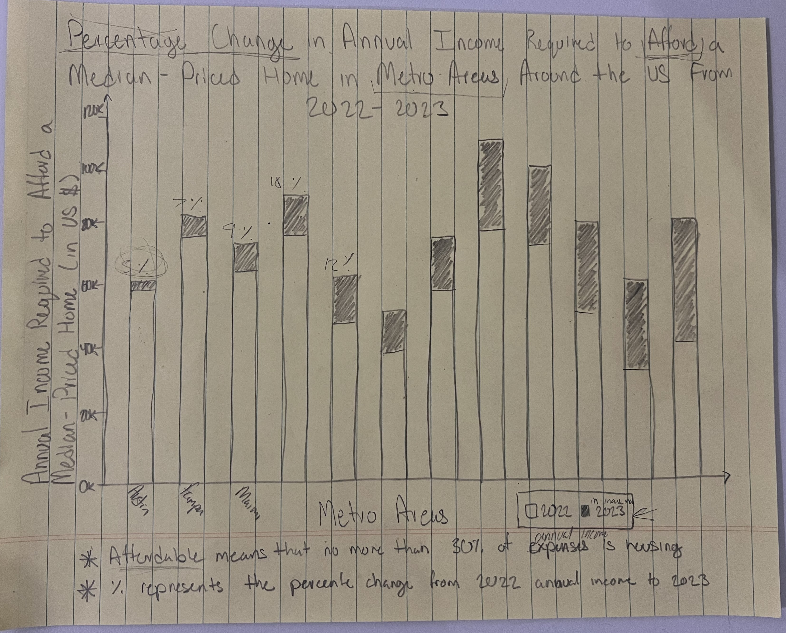

[Home]( https://pbm15.github.io/Mitchell-Portfolio/)

# Assignment 3+4

## Part one: 
https://www.redfin.com/news/homebuyer-income-afford-home-record-high/

I chose this data because the topic was interesting to me, and the graphic used needed an update. The graphic used in this article is just a table that gives all the same data found in the Excel file they used to make the table. Because everything is included and it uses a table, there is not much in the way of a story being told, and the data is not easily visually understandable. It is for all of these reasons that I chose this graphic to redesign to help it fit more with the message of the article.

## Part two: 
### Usefulness: 10
It has all the data and can be used to find an example of a city of most sizes

### Completeness:10
It contains all the relevant data necessary

### Perceptibility: 2
It can be unwieldy do to the amount of data
  
### Truthfulness: 10
The data is unaltered from the source and is not presented in a un-honest manner
  
### Intuitiveness: 10
The type of graph used is common and easily readable to a wide audience
  
### Aesthetics: 3
The graphic is boring and large 
  
### Engagement: 3
The graphic is boring and large 

### Describe your overall observations about the data visualization here.  What stood out to you?  What did you find worked really well?  What didn't?  What, if anything, would you do differently?  
What stood out was that it was just a mass of raw data with no real message behind it. I think using a selection of cities was good to show the range of costs associated with buying a house in the US. I didn't think that using all of the cities was the best as it made the visual cluttered and vague in its point. I would reduce the amount of information and the size of the graphic.

### Who is the primary audience for this tool?  Do you think this visualization is effective for reaching that audience?  Why or why not?
Residents of the US who are or plan to buy a house. No, it is a bit bland and large in size, so it is probably intimidating to the average viewer.

### Final thoughts: how successful what this method at evaluating the data visualization you selected? Are there measures you feel are missing or not being captured here?  What would you change?  Provide 1-2 recommendations (color, type of visualization, layout, etc.)
I thought it did a good job and that it really reminded me of doing the out-loud visual critique. I think that it covers most of the bases, but there will always be a bit more detail that could be captured in the critique. I think that this visual could be honed down to a few major points and simplified in the categories of data used. Also, the type of graph could be changed to show the difference between the metro areas better.

## Part three: 

The image was taken on my phone and then uploaded to Gethub.

The image was taken on my phone and then uploaded to Gethub.

The image was taken on my phone and then uploaded to Gethub.

This series of images shows my process of developing ways to focus the data and tell the story the article was trying to tell.

## Part four: 

## Part five: 
