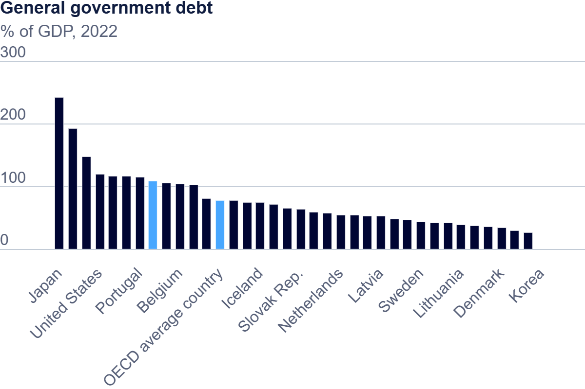

[Home]( https://pbm15.github.io/Mitchell-Portfolio/)

# Visualizing Government Debt

## Part one: Working with web-based visualization tools and data

The image was downloaded and then uploaded to Gethub.

## Working with Tableau

  <noscript>
    
  </noscript>
  <object class='tableauViz'  style='display:none;'>
    <param name='host_url' value='https%3A%2F%2Fpublic.tableau.com%2F' />
    <param name='embed_code_version' value='3' /> 
    <param name='site_root' value='' />
    <param name='name' value='Assignment2_17307638604340&#47;Sheet1' />
    <param name='tabs' value='no' />
    <param name='toolbar' value='yes' />
    <param name='static_image' value='https:&#47;&#47;public.tableau.com&#47;static&#47;images&#47;As&#47;Assignment2_17307638604340&#47;Sheet1&#47;1.png' />
    <param name='animate_transition' value='yes' />
    <param name='display_static_image' value='yes' />
    <param name='display_spinner' value='yes' />
    <param name='display_overlay' value='yes' />
    <param name='display_count' value='yes' />
    <param name='language' value='en-US' />
    <param name='filter' value='publish=yes' />
  </object>

    

I followed the instructions for uploading the data and editing it within Tableau and then uploaded the file to Tableau Public to allow the graphic to be added to this page.

## Part three: create your own visualization

  <noscript>
    
  </noscript>
  <object class='tableauViz'  style='display:none;'>
    <param name='host_url' value='https%3A%2F%2Fpublic.tableau.com%2F' /> 
    <param name='embed_code_version' value='3' /> 
    <param name='site_root' value='' />
    <param name='name' value='Assignment2v2_17307667385170&#47;Sheet1' />
    <param name='tabs' value='no' />
    <param name='toolbar' value='yes' />
    <param name='static_image' value='https:&#47;&#47;public.tableau.com&#47;static&#47;images&#47;As&#47;Assignment2v2_17307667385170&#47;Sheet1&#47;1.png' /> 
    <param name='animate_transition' value='yes' />
    <param name='display_static_image' value='yes' />
    <param name='display_spinner' value='yes' />
    <param name='display_overlay' value='yes' />
    <param name='display_count' value='yes' />
    <param name='language' value='en-US' />
    <param name='filter' value='publish=yes' />
  </object>

                

These different methods of visualization showcase how the same data can be used in different ways. For example, in the first image, we use the majority of the governments over the total timeline presented in a heat map using two colors to highlight the highest points and lowest points in the data set. In my second image, I have only the data from 2010 with only one color in an area chart to highlight the countries with the highest debt ratio during this time. These differences in chart type and use of color change what you are able to highlight in the data and how you can create a story from the data depending on how you use it. 

For this second graph, I chose to do this more pointed graphic to try to focus on specific data. I learned how to filter the data I needed in addition to learning how to create an area chart that displays the data I wanted. By focusing on specific data, I was able to use a different visualization method like the area graph, allowing me to immediately highlight the largest data points compared to the other graphic where color is more important in showing data at first glance by using two colors to denote high and low. In addition, by only using one color, I was able to further reinforce the size of the data by using the concentration of color to also represent size, creating a second visual element that highlighted the data size.
